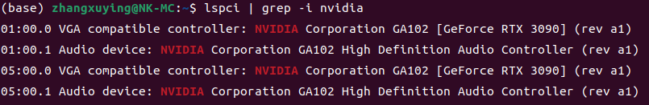
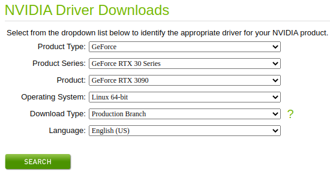

## 安装Nvidia显卡驱动
### 1. 下载驱动文件  
- 查看显卡类型
```
lspci | grep -i nvidia
```
<p align="center">
  
</p>

- 前往[nvidia 官网](https://www.nvidia.com/Download/index.aspx)选择驱动文件并下载
<p align="center">
  
</p>

### 2. 禁用nouveau
使用命令```lsmod | grep nouveau```查看nouveau是否已被禁用。  
若有，则直接跳到下一步；  
若没有，则在文件```/etc/modprobe.d/blacklist.conf ```的末尾处添加
```
blacklist nouveau
options nouveau modeset=0
```
更新```sudo update-initramfs -u```并重启电脑（sudo reboot now）。


### 3. 卸载Ubuntu自带的驱动程序
```
sudo apt-get remove –purge nvidia*
```

### 4. 安装驱动程序
- 预备工作
```
sudo apt-get update
sudo apt-get install gcc
sudo apt-get install g++
sudo apt-get install make
sudo chmod a+x NVIDIA-Linux-x86_64-xxx.xxx.run
```
- 开始安装（默认操作即可）
```
sudo ./NVIDIA-Linux-x86_64-xxx.xxx.run -no-x-check -no-nouveau-check -no-opengl-files

```

### 5. 确认安装成功
```
nvidia-smi 
```

### 6. 解决nvidia-smi刷新慢的问题
```
sudo nvidia-persistenced --persistence-mode
```

